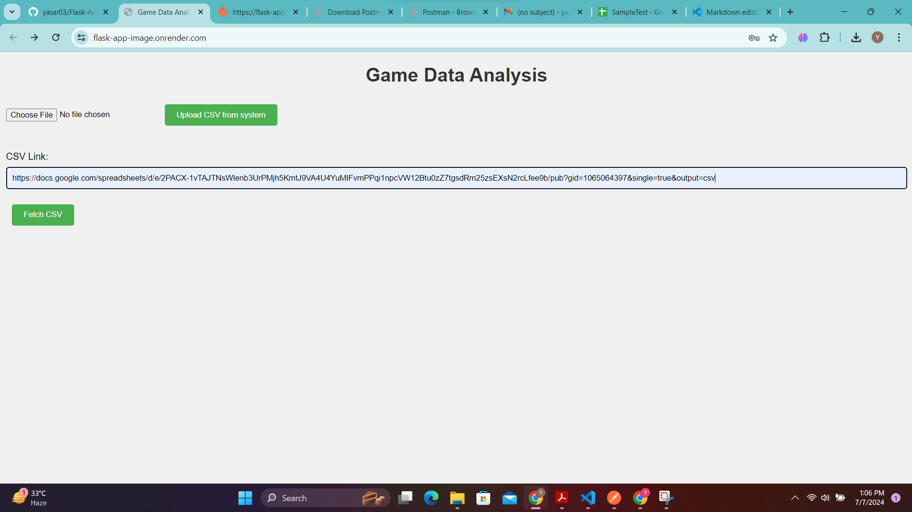

---

# Game Data Analysis Web Application

This web application allows users to upload game data CSV files, query the data, and perform aggregate operations. The application is built using Flask, SQLite, and pandas on the backend, with HTML, CSS, and JavaScript for the frontend.

## Features

- User login with roles (admin and guest)
- Upload game data CSV files
- Fetch and upload game data from a public CSV link
- Query data with filters
- Perform aggregate operations on numerical data
- View results in a tabular format

## Setup

### Prerequisites

- Python 3.9
- Flask
- pandas
- requests
- flask-cors

### Installation

1. Clone the repository:
    ```bash
    git clone https://github.com/yasar03/Flask-App-Image.git
    cd Flask-App-Image
    ```

2. Install the required Python packages:
    ```bash
    pip install -r requirements.txt
    ```

3. Initialize the database:
    ```bash
    python -c "from app import init_db; init_db()"
    ```

### Configuration

Set your secret key and admin password in the `app.py` file:
    ```python
    app.secret_key = 'your_secret_key_here'
    ADMIN_PASSWORD = 'admin123'
    ```

### Running the Application

1. Start the Flask server:
    ```bash
    python app.py
    ```

2. Open your browser and navigate to `http://localhost:5000`.

### Deployment

The application is deployed and can be accessed at: [https://flask-app-image.onrender.com/](https://flask-app-image.onrender.com/)

## Usage

### Login

- Select your user type (admin or guest).
- If you are an admin, enter the admin password(Password for admin is 'admin123').


### Upload CSV

- To upload a CSV file from your system:
    - Select the CSV file.
    - Click on the "Upload CSV from system" button.
- To upload a CSV file from a public link:
    - Enter the CSV link.
    - Click on the "Fetch CSV" button.

- Note: The CSV file could be as large as 150MB because the file is read in smaller chunks, and we load a portion of the data into memory at a time, significantly reducing memory usage.

Sample CSV file link: [Sample CSV](https://docs.google.com/spreadsheets/d/e/2PACX-1vTAJTNsWIenb3UrPMjh5KmtJ9VA4U4YuMIFvmPPqi1npcVW12Btu0zZ7tgsdRm25zsEXsN2rcLfee9b/pub?gid=1065064397&single=true&output=csv)



### Query Data

1. Select the column you want to query.
2. If filtering:
    - Enter the filter value.
    - If column is of string type then substring matching is allowed if it is numeric or date type then only exact value match is allowed
    - If a numeric type column is selected then only filter operator dropdown will appear. Select the filter operator (Equal to, Greater than, Less than, Greater than or equal to, Less than or equal to).
    - Click on the "Filtered Query" button.
3. If aggregating(Only for numeric type column):
    - Select the aggregate function (Sum, Max, Min, Mean).
    - Click on the "Aggregate Data Query" button.

- List of column names in the dropdown menu to be selected for making query:


- Filtered query on a string type column:


- Filtered query on date:


- Filtered query on numeric type column with filter operator:


- Aggregate data query on numeric type column:


### Logout

- Clear your session by sending a POST request to `/logout`.

### API Sample Request/Response

### 1. Login Endpoint

**Endpoint:** `POST /login`

**Request:**
```bash
curl -X POST \
  http://flask-app-image.onrender.com/login \
  -H 'Content-Type: application/json' \
  -d '{
        "user_type": "admin",
        "password": "admin123"
      }'
```

**Response:**
```json
{
  "success": True
}
```
Or in case of invalid password:
```json
{
  "success": False,
  "message": "Invalid password"
}
```

### 2. Logout Endpoint

**Endpoint:** `POST /logout`

**Request:**
```bash
curl -X POST \
  http://flask-app-image.onrender.com/logout
```

**Response:**
```json
{
  "success": True
}
```

### 3. Upload CSV from Link Endpoint

**Endpoint:** `POST /upload_csv_from_link`

**Request:**
```bash
curl -X POST \
  http://flask-app-image.onrender.com/upload_csv_from_link \
  -H 'Content-Type: application/json' \
  -d '{
        "csv_link": "https://docs.google.com/spreadsheets/d/e/2PACX-1vTAJTNsWIenb3UrPMjh5KmtJ9VA4U4YuMIFvmPPqi1npcVW12Btu0zZ7tgsdRm25zsEXsN2rcLfee9b/pub?gid=1065064397&single=true&output=csv"
      }'
```

**Response:**
```json
{
  "success": True
}
```
Or in case of errors:
```json
{
  "success": False,
  "error": "The provided link does not point to a CSV file."
}
```
Or:
```json
{
  "success": False,
  "error": "Error fetching CSV file: <error message>"
}
```
Or:
```json
{
  "success": False,
  "error": "Unexpected error: <error message>"
}
```

### 4. Query Data Endpoint

**Endpoint:** `GET /query`

**Request:**
```bash
curl -X GET \
  'http://flask-app-image.onrender.com//query?query_type=select&Requiredage=18&filter_operator=eq'
```

**Response:**
```json
[
    {
        "Unnamed:0": 91,
        "AppID": 1225870,
        "Name": "Hentai Girlfriend Simulator",
        "Releasedate": "Jan 31, 2020",
        "Requiredage": 18,
        "Price": 1.19,
        "DLCcount": 0,
        "Aboutthegame": "Have you ever thought of making yourself the perfect girlfriend? Now your dreams will come true! In this girlfriend simulator, you get complete control over relationships. Choose one of 3 girls with whom you will spend your time (or maybe eternity). You can do trivial things - watch TV together, walk. And you can act like a complete asshole! Tear off her clothes right on the street, offend or even push her under the car. Is it really realistic? Above all, you will need to earn money to support your girlfriend. Buying her food and trinkets. Feel the true experience of owning a girlfriend!",
        "Supportedlanguages": "['English']",
        "Windows": 1,
        "Mac": 0,
        "Linux": 0,
        "Positive": 0,
        "Negative": 0,
        "Scorerank": null,
        "Developers": "Slippy Floor",
        "Publishers": "Slippy Floor",
        "Categories": "Single-player",
        "Genres": "Indie,Simulation",
        "Tags": null
    }
]
```

### 5. Aggregate Search Endpoint

**Endpoint:** `GET /query?query_type=aggregate&agg_column=age&agg_function=max`

**Request:**
```bash
curl -X GET \
  'http://flask-app-image.onrender.com/query?query_type=aggregate&agg_column=Requiredage&agg_function=max'
```

**Response:**
```json
[
  {
    "result": 18
  }
]
```

### 6. Get Columns Endpoint

**Endpoint:** `GET /columns`

**Request:**
```bash
curl -X GET \
  http://flask-app-image.onrender.com/columns
```

**Response:**
```json
[
    "Unnamed:0",
    "AppID",
    "Name",
    "Releasedate",
    "Requiredage",
    "Price",
    "DLCcount",
    "Aboutthegame",
    "Supportedlanguages",
    "Windows",
    "Mac",
    "Linux",
    "Positive",
    "Negative",
    "Scorerank",
    "Developers",
    "Publishers",
    "Categories",
    "Genres",
    "Tags"
]
```


## Frontend

The frontend is implemented in HTML, CSS, and JavaScript. It includes forms for login, CSV upload, and data querying. The results are displayed in a table format.

## Contributing

Feel free to fork the repository and submit pull requests. For major changes, please open an issue first to discuss what you would like to change.

---
